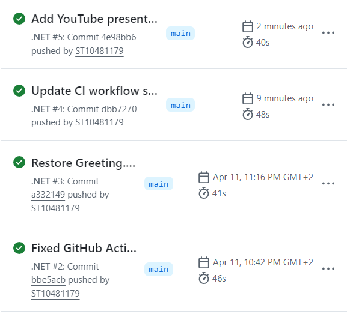

# CyberSecurityChatbot

A C# console chatbot that provides cybersecurity guidance with a voice greeting, ASCII banner, personalized user interaction, and enhanced console styling.

## Features

- Plays a `Greeting.wav` audio welcome message when the program starts
- Displays a custom ASCII art banner
- Asks for the user name and personalizes responses
- Answers cybersecurity questions about passwords, phishing, malware, VPNs, and account security
- Validates empty input and handles unknown questions gracefully
- Uses colors, borders, and typing effects for a polished console UI
- Includes GitHub Actions CI for build validation

## Run the project

1. Open the project folder in VS Code.
2. Build and run with:
   ```bash
   dotnet run --project CyberSecurityChatbot.csproj
   ```

## Continuous integration

This README includes a screenshot of a successful GitHub Actions workflow run showing the green check mark.

> Add the screenshot file to the repository as `github-actions-success.png` and keep this image reference here.



## Presentation submission

Task 1 should be submitted as a YouTube unlisted link. Include the unlisted video URL here once the recording is complete.

- Presentation link: https://youtu.be/OmiRFFJdaC8

## Audio greeting

Place `Greeting.wav` in the `CyberSecurityChatbot` project folder or the output folder so the bot can play the welcome message automatically.

## Notes

The project is structured into:

- `Program.cs` - application entry point
- `Chatbot.cs` - chatbot interaction and response logic
- `User.cs` - user profile data
- `AudioPlayer.cs` - WAV playback support
- `.github/workflows/dotnet.yml` - CI build workflow
